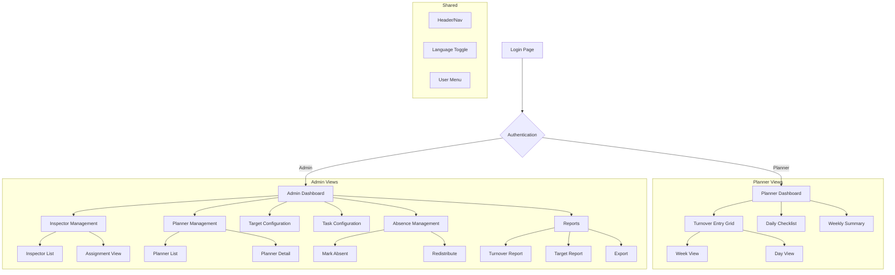
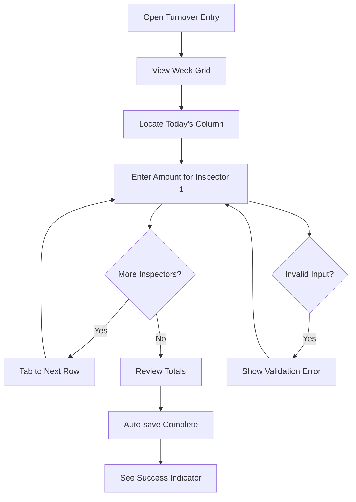
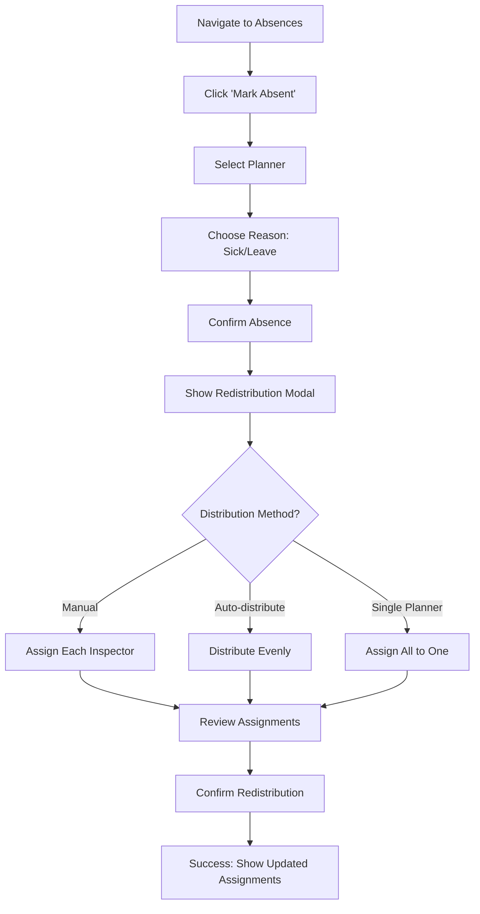
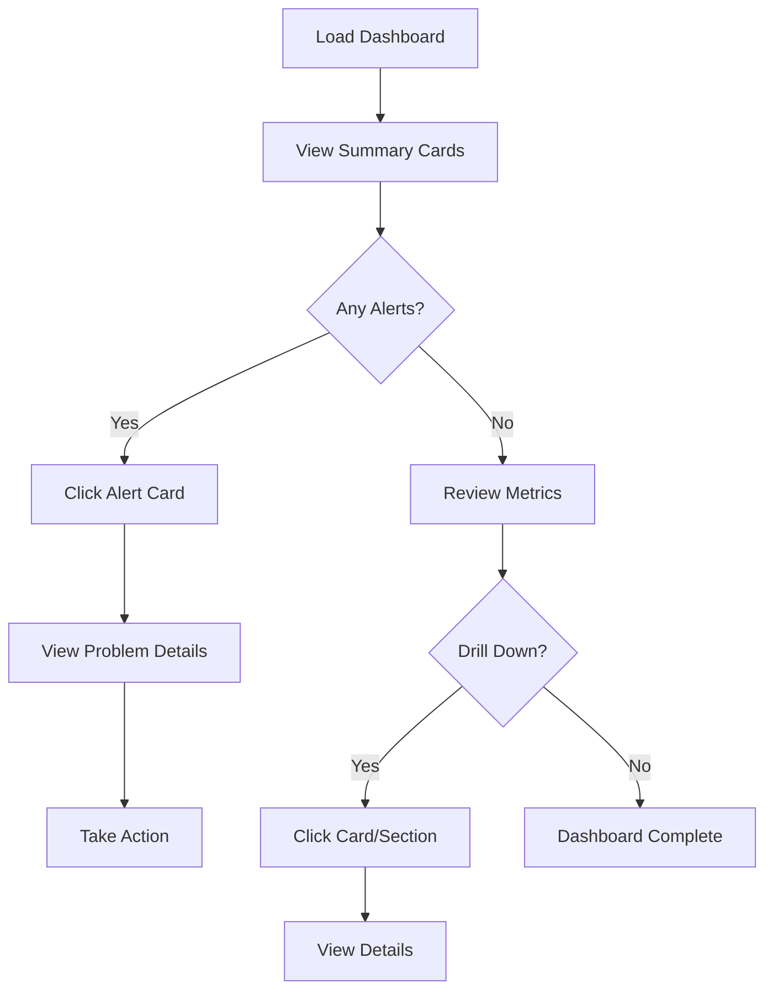
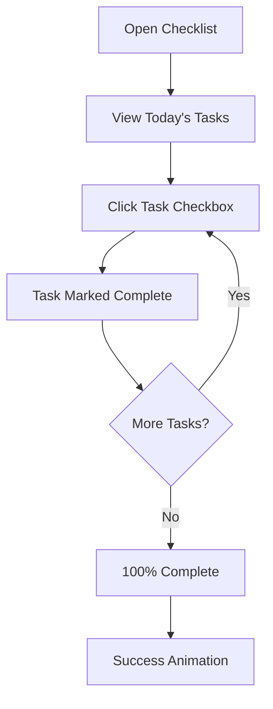

# Planning Checklist Application - UI/UX Specification

## Introduction

This document defines the user experience goals, information architecture, user flows, and visual design specifications for the Planning Checklist Application's user interface. It serves as the foundation for visual design and frontend development, ensuring a cohesive and user-centered experience.

### Overall UX Goals & Principles

#### Target User Personas

**Planner (Primary User)**
- Office-based professional completing daily administrative tasks
- Currently comfortable with Excel workflows
- Needs efficiency for repetitive daily data entry
- Works primarily on desktop, occasionally tablet
- Bilingual (Dutch/French)
- Tech comfort: Moderate - familiar with Microsoft 365 tools

**Administrator**
- Supervisory role overseeing multiple planners
- Needs quick access to status information and alerts
- Makes decisions about resource allocation and coverage
- Requires historical data for reporting and analysis
- Tech comfort: Moderate to high

#### Usability Goals

1. **Ease of transition**: Users familiar with Excel can complete core tasks without training
2. **Efficiency of use**: Daily turnover entry completable in under 5 minutes
3. **Glanceability**: Dashboard status visible and understandable within 3 seconds
4. **Error prevention**: Validation and confirmation for destructive actions
5. **Immediate feedback**: Every action provides clear visual confirmation
6. **Accessibility**: Support for keyboard navigation and screen readers

#### Design Principles

1. **Familiar patterns** - Mimic spreadsheet/grid interactions planners already know from Excel
2. **Status at a glance** - Use color coding consistently to show target achievement status
3. **Progressive disclosure** - Show summary first, details on demand
4. **Minimal clicks** - Optimize for the daily workflow; reduce friction
5. **Bilingual first** - All text externalized; UI adapts seamlessly to language switch

### Change Log

| Date | Version | Description | Author |
|------|---------|-------------|--------|
| 2026-01-20 | 0.1 | Initial UI/UX specification | UX Expert Agent |

---

## Information Architecture (IA)

### Site Map / Screen Inventory



### Navigation Structure

**Primary Navigation (Sidebar)**

*For Planners:*
- 📊 Dashboard (default)
- 📝 Turnover Entry
- ✅ Checklist
- 📈 Weekly Summary

*For Administrators:*
- 📊 Dashboard (default)
- 👥 Inspectors
- 👤 Planners
- 🎯 Targets
- ✅ Tasks
- 🏥 Absences
- 📈 Reports

**Header Navigation:**
- Logo/App name (left)
- Language toggle: NL | FR (center-right)
- User menu with role indicator (right)
- Logout option

**Breadcrumb Strategy:**
- Show on detail pages only
- Format: Section > Subsection > Item
- Example: `Inspectors > Jan Peeters > Assignment History`

---

## User Flows

### Flow 1: Daily Turnover Entry (Planner)

**User Goal:** Enter today's turnover amounts for all assigned inspectors

**Entry Points:** 
- Dashboard quick action
- Sidebar "Turnover Entry"
- Direct URL

**Success Criteria:** All inspector turnover values saved with visual confirmation



**Edge Cases & Error Handling:**
- Network disconnection: Queue changes locally, sync when reconnected
- Invalid input (non-numeric): Inline validation, prevent save
- Session timeout: Prompt re-login, preserve unsaved data

**Notes:** Auto-save with debounce (500ms) provides seamless experience without explicit save button.

---

### Flow 2: Mark Planner Absent & Redistribute (Admin)

**User Goal:** Handle planner absence by redistributing their inspectors

**Entry Points:**
- Admin dashboard alert
- Planner list quick action
- Absence management section

**Success Criteria:** Planner marked absent, all inspectors reassigned



**Edge Cases & Error Handling:**
- Only one active planner remaining: Warning, suggest alternative
- Inspector with in-progress entries: Show notification to receiving planner
- Undo needed: Allow reversal within 24 hours

---

### Flow 3: Admin Dashboard Monitoring

**User Goal:** Get quick overview of all operations and identify issues

**Entry Points:**
- Default landing page for admins
- Header logo click

**Success Criteria:** Admin can identify any issues within 10 seconds



**Edge Cases & Error Handling:**
- Real-time connection lost: Show "Live" indicator change to "Offline"
- Data loading slow: Show skeleton loaders, not spinners
- No data for period: Show empty state with helpful message

---

### Flow 4: Complete Daily Checklist (Planner)

**User Goal:** Complete all assigned daily tasks

**Entry Points:**
- Dashboard checklist widget
- Sidebar "Checklist"

**Success Criteria:** All tasks marked complete



**Edge Cases & Error Handling:**
- Accidentally mark complete: Allow uncheck within same day
- Task added mid-day by admin: Appears with "New" badge

---

## Wireframes & Key Screen Layouts

**Primary Design Files:** To be created in Figma (link TBD)

### Screen: Planner Daily Dashboard

**Purpose:** Landing page for planners showing today's summary and quick actions

**Key Elements:**
- Welcome message with date and language indicator
- Today's checklist progress card (circular progress)
- Today's turnover summary card (total vs target)
- Quick action buttons: "Enter Turnover", "View Checklist"
- List of assigned inspectors with today's status

**Interaction Notes:** Cards are clickable for drill-down. Progress indicators animate on load.

---

### Screen: Turnover Entry Grid

**Purpose:** Primary data entry screen for daily inspector turnover

**Key Elements:**
- Week selector (previous/next week arrows, current week highlighted)
- Grid: Rows = Inspectors, Columns = Days (Mon-Sun)
- Each cell: Input field with target indicator background
- Row totals (per inspector weekly)
- Column totals (daily total for planner)
- Grand total (weekly total)
- Color coding: Red (<80%), Amber (80-99%), Green (≥100%)

**Interaction Notes:** 
- Tab moves between cells (left-to-right, then next row)
- Enter moves down to next inspector
- Cells auto-save after 500ms idle
- Current day column has subtle highlight

**ASCII Wireframe:**
```
┌─────────────────────────────────────────────────────────────────────────────┐
│  ◀ Week 3, January 2026 ▶                              [NL|FR]  👤 Jan ▼   │
├─────────────────────────────────────────────────────────────────────────────┤
│                                                                             │
│  ┌─────────────┬────────┬────────┬────────┬────────┬────────┬────────┬────┐│
│  │ Inspector   │ Mon 13 │ Tue 14 │ Wed 15 │ Thu 16 │ Fri 17 │ Sat 18 │ Σ  ││
│  ├─────────────┼────────┼────────┼────────┼────────┼────────┼────────┼────┤│
│  │ Peeters J.  │ [250]🟢│ [180]🟡│ [____] │        │        │        │ 430││
│  │ De Vries M. │ [300]🟢│ [290]🟢│ [____] │        │        │        │ 590││
│  │ Janssen K.  │ [150]🔴│ [200]🟡│ [____] │        │        │        │ 350││
│  ├─────────────┼────────┼────────┼────────┼────────┼────────┼────────┼────┤│
│  │ Daily Total │   700  │   670  │    0   │        │        │        │1370││
│  │ vs Target   │  100%  │   96%  │   0%   │        │        │        │ 65%││
│  └─────────────┴────────┴────────┴────────┴────────┴────────┴────────┴────┘│
│                                                                             │
│  ✓ Auto-saved                                    Success Days: 1/2 (50%)   │
└─────────────────────────────────────────────────────────────────────────────┘
```

---

### Screen: Admin Dashboard

**Purpose:** Real-time overview of all operations for administrators

**Key Elements:**
- Summary cards row: Total Planners, Total Inspectors, Today's Turnover, Completion Rate
- Alert section: Incomplete checklists, Missing data, Absent planners
- Planner status table: Name, Status, Inspectors, Checklist %, Today's Turnover
- Live indicator: "🟢 Live" / "🔴 Offline"

**Interaction Notes:**
- Cards pulse briefly when data updates
- Click row to view planner details
- Alert badges show count

**ASCII Wireframe:**
```
┌─────────────────────────────────────────────────────────────────────────────┐
│  Admin Dashboard                          🟢 Live    [NL|FR]  👤 Admin ▼   │
├─────────────────────────────────────────────────────────────────────────────┤
│                                                                             │
│  ┌──────────────┐ ┌──────────────┐ ┌──────────────┐ ┌──────────────┐       │
│  │  5 Planners  │ │ 48 Inspectors│ │ €12,450      │ │ 85%          │       │
│  │  4 active    │ │ 2 unassigned │ │ Today Total  │ │ Checklists   │       │
│  └──────────────┘ └──────────────┘ └──────────────┘ └──────────────┘       │
│                                                                             │
│  ⚠️ Alerts (2)                                                              │
│  ├─ Jan Peeters: Checklist incomplete (60%)                                │
│  └─ Marie Dubois: Absent - 3 inspectors need reassignment                  │
│                                                                             │
│  ┌─────────────────────────────────────────────────────────────────────────┐│
│  │ Planner        │ Status  │ Inspectors │ Checklist │ Turnover │ Actions ││
│  ├─────────────────────────────────────────────────────────────────────────┤│
│  │ Jan Peeters    │ 🟢 Active │    10     │   60% 🟡  │  €2,450  │  ⋮     ││
│  │ Kris Janssen   │ 🟢 Active │    12     │  100% 🟢  │  €3,200  │  ⋮     ││
│  │ Marie Dubois   │ 🔴 Absent │     8     │    -      │    -     │  ⋮     ││
│  │ Peter Maes     │ 🟢 Active │    10     │  100% 🟢  │  €3,600  │  ⋮     ││
│  │ Lisa Wouters   │ 🟢 Active │     8     │  100% 🟢  │  €3,200  │  ⋮     ││
│  └─────────────────────────────────────────────────────────────────────────┘│
└─────────────────────────────────────────────────────────────────────────────┘
```

---

### Screen: Inspector Management

**Purpose:** Admin view to manage all inspectors and their assignments

**Key Elements:**
- Search/filter bar
- Inspector table: Name, Assigned Planner, Status, Actions
- Bulk action toolbar (appears on selection)
- Add Inspector button
- Quick reassign dropdown per row

---

### Screen: Absence Management

**Purpose:** Mark planners absent and redistribute inspectors

**Key Elements:**
- Active/Absent planner tabs
- Mark Absent button with modal
- Redistribution wizard (step-by-step)
- Current absences list with inspector counts

---

## Component Library / Design System

**Design System Approach:** Use Nuxt UI component library as foundation, extend with custom components for domain-specific needs.

### Core Components

#### Data Entry Cell

**Purpose:** Individual cell in turnover grid for amount entry

**Variants:** Empty, Filled, Disabled (future date), Readonly (past, locked)

**States:** Default, Focus, Saving, Saved, Error, Below Target, On Target, Above Target

**Usage Guidelines:** 
- Always show target status via background color
- Show saving indicator during auto-save
- Validation inline, not in modal

---

#### Status Badge

**Purpose:** Show status of entities (planners, tasks, etc.)

**Variants:** Active, Absent, Complete, Incomplete, Warning, Error

**States:** Default, Hover (shows tooltip with details)

**Usage Guidelines:**
- Use consistently across all status displays
- Include icon + text for accessibility
- Color alone should not convey meaning

---

#### Summary Card

**Purpose:** Display key metric with label on dashboard

**Variants:** Standard, Alert (with warning indicator), Clickable

**States:** Loading (skeleton), Loaded, Error, Updating (pulse)

**Usage Guidelines:**
- Max 4 cards per row
- Click navigates to detail view
- Show trend indicator where applicable

---

#### Language Toggle

**Purpose:** Switch between Dutch and French

**Variants:** Button group style

**States:** NL active, FR active

**Usage Guidelines:**
- Always visible in header
- Immediate effect, no page reload
- Persist preference

---

## Branding & Style Guide

### Visual Identity

**Brand Guidelines:** No existing brand guidelines. Create clean, professional look suitable for business application.

### Color Palette

| Color Type | Hex Code | Usage |
|------------|----------|-------|
| Primary | `#2563EB` (Blue 600) | Primary actions, links, focus states |
| Primary Dark | `#1D4ED8` (Blue 700) | Hover states, active elements |
| Secondary | `#64748B` (Slate 500) | Secondary text, icons |
| Accent | `#8B5CF6` (Violet 500) | Highlights, special features |
| Success | `#22C55E` (Green 500) | Target achieved, positive feedback |
| Warning | `#F59E0B` (Amber 500) | Near target, cautions |
| Error | `#EF4444` (Red 500) | Below target, errors, destructive |
| Neutral Light | `#F8FAFC` (Slate 50) | Page backgrounds |
| Neutral | `#E2E8F0` (Slate 200) | Borders, dividers |
| Neutral Dark | `#1E293B` (Slate 800) | Primary text |

### Typography

#### Font Families

- **Primary:** Inter (clean, modern, excellent for data)
- **Secondary:** Inter (single font family for consistency)
- **Monospace:** JetBrains Mono (for numeric data in grid)

#### Type Scale

| Element | Size | Weight | Line Height |
|---------|------|--------|-------------|
| H1 | 2rem (32px) | 700 | 1.2 |
| H2 | 1.5rem (24px) | 600 | 1.3 |
| H3 | 1.25rem (20px) | 600 | 1.4 |
| Body | 1rem (16px) | 400 | 1.5 |
| Small | 0.875rem (14px) | 400 | 1.4 |
| Data Cell | 0.875rem (14px) | 500 | 1.2 |

### Iconography

**Icon Library:** Heroicons (included with Nuxt UI) or Lucide Icons

**Usage Guidelines:**
- Use outline style for navigation, solid for status
- 20px default size, 16px for inline
- Always pair with text label for actions (except obvious icons like X for close)

### Spacing & Layout

**Grid System:** 12-column grid, max-width 1440px centered

**Spacing Scale:** 
- 4px base unit
- Common values: 4, 8, 12, 16, 24, 32, 48, 64
- Component padding: 16px standard, 24px for cards
- Section spacing: 32px between major sections

---

## Accessibility Requirements

### Compliance Target

**Standard:** WCAG 2.1 Level AA

### Key Requirements

**Visual:**
- Color contrast ratios: Minimum 4.5:1 for text, 3:1 for large text and UI components
- Focus indicators: Visible 2px outline on all interactive elements
- Text sizing: Support browser zoom up to 200% without horizontal scroll

**Interaction:**
- Keyboard navigation: Full functionality via keyboard only
- Screen reader support: Proper ARIA labels, roles, and live regions
- Touch targets: Minimum 44x44px for all interactive elements

**Content:**
- Alternative text: All meaningful images have descriptive alt text
- Heading structure: Proper H1-H6 hierarchy, single H1 per page
- Form labels: All inputs have visible labels, error messages linked to fields

### Testing Strategy

- Automated: axe-core integration in CI/CD
- Manual: Keyboard-only testing for all flows
- Screen reader: Test with NVDA/VoiceOver quarterly
- Color blindness: Verify with Sim Daltonism or similar tool

---

## Responsiveness Strategy

### Breakpoints

| Breakpoint | Min Width | Max Width | Target Devices |
|------------|-----------|-----------|----------------|
| Mobile | 0px | 639px | Phones (limited support) |
| Tablet | 640px | 1023px | Tablets, small laptops |
| Desktop | 1024px | 1439px | Laptops, desktops |
| Wide | 1440px | - | Large monitors |

### Adaptation Patterns

**Layout Changes:**
- Mobile: Stack all elements vertically, simplified views
- Tablet: 2-column layouts, collapsible sidebar
- Desktop: Full sidebar visible, multi-column layouts
- Wide: Comfortable spacing, max-width container

**Navigation Changes:**
- Mobile/Tablet: Hamburger menu, bottom navigation for key actions
- Desktop: Full sidebar always visible

**Content Priority:**
- Mobile: Show summary only, drill-down for details
- Tablet+: Show summary with immediate access to details

**Interaction Changes:**
- Touch: Larger tap targets, swipe gestures for navigation
- Mouse: Hover states, right-click context menus

**Note:** Primary target is desktop. Mobile is "functional but not optimized."

---

## Animation & Micro-interactions

### Motion Principles

1. **Purposeful**: Animation serves function (feedback, orientation), not decoration
2. **Quick**: Most animations under 200ms, complex ones under 400ms
3. **Subtle**: Enhance without distracting from data entry tasks
4. **Reducible**: Respect `prefers-reduced-motion` media query

### Key Animations

- **Auto-save indicator**: Fade in spinner, fade out to checkmark (Duration: 300ms, Easing: ease-out)
- **Cell target status**: Background color transition on value change (Duration: 200ms, Easing: ease-in-out)
- **Dashboard card update**: Subtle pulse/scale on real-time data change (Duration: 400ms, Easing: ease-out)
- **Modal open/close**: Fade + scale from center (Duration: 200ms, Easing: ease-out)
- **Sidebar collapse**: Width transition (Duration: 200ms, Easing: ease-in-out)
- **Success celebration**: Confetti or checkmark animation on 100% checklist (Duration: 600ms)

---

## Performance Considerations

### Performance Goals

- **Page Load:** First Contentful Paint < 1.5s, Largest Contentful Paint < 2.5s
- **Interaction Response:** All interactions respond in < 100ms
- **Animation FPS:** Maintain 60fps for all animations

### Design Strategies

- Use skeleton loaders during data fetch
- Virtualize long lists (inspector list if > 50 items)
- Lazy load report data and non-critical components
- Optimize images with WebP format
- Debounce auto-save to reduce API calls
- Use SSE instead of polling for real-time updates

---

## Next Steps

### Immediate Actions

1. Review this specification with stakeholders
2. Create high-fidelity mockups in Figma for key screens
3. Finalize color palette and typography choices
4. Create component library in Figma matching Nuxt UI
5. Proceed to Architecture document creation

### Design Handoff Checklist

- [x] All user flows documented
- [x] Component inventory complete
- [x] Accessibility requirements defined
- [x] Responsive strategy clear
- [x] Brand guidelines incorporated
- [x] Performance goals established

---

*Document created by: BMad UX Expert Agent*
*Workflow: greenfield-fullstack*
*Next step: Architect Agent → Architecture Document*
